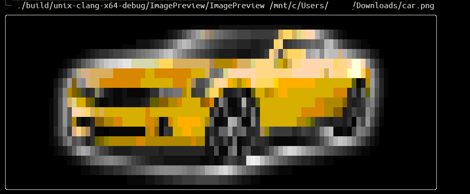

# Terminal Image Preview

### build

    cmake -S ./ --preset=unix-clang-x64-release     # or windows-clang-x64-release
    cmake --build --preset=unix-clang-x64-release   # or windows-clang-x64-release

### run 

    ./build/${preset}/ImagePreview/ImagePreview ./images/car.png

    hit `q` key to exit

### example

